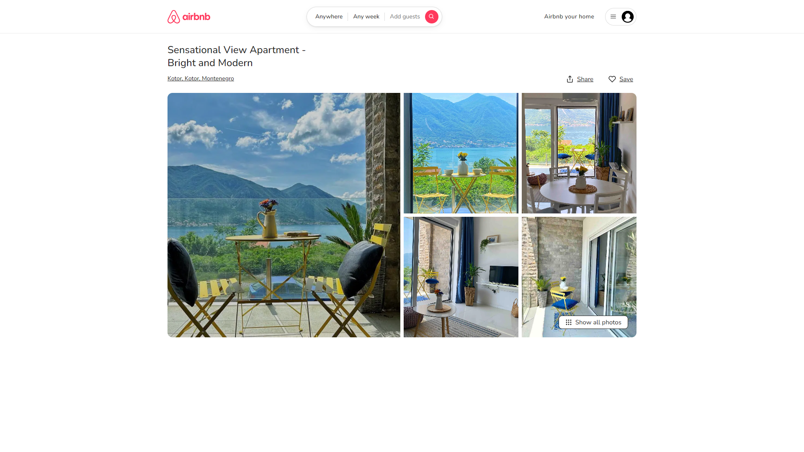
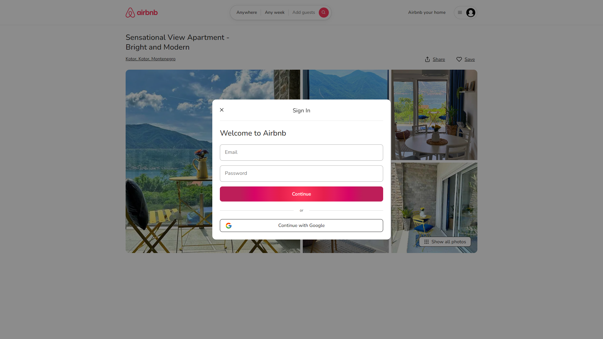
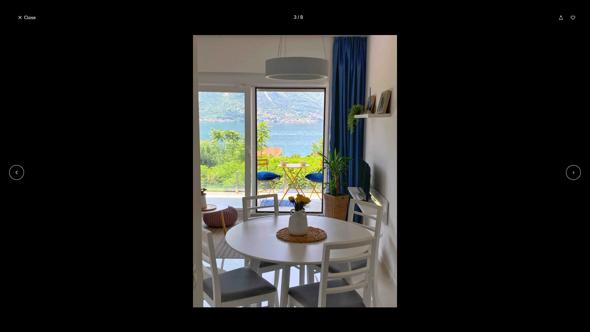
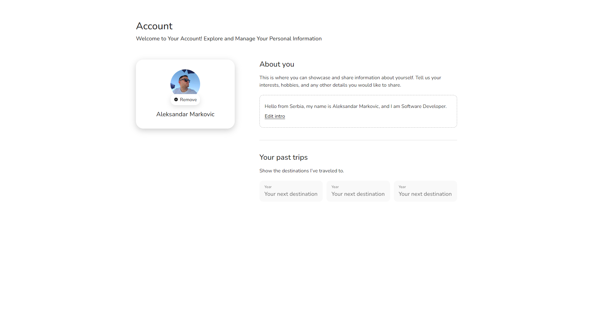

# Airbnb Clone

## Overview

The **Airbnb Clone** project is a work-in-progress web application that replicates some of the core functionalities of Airbnb. Built using React.js for the frontend and Firebase as the backend service, this project serves as a portfolio piece to demonstrate proficiency in modern web development practices, including user authentication, data management, and responsive UI design.

## Demo

Check out the live demo of the Airbnb Clone application:

[Live Demo on Netlify](https://airnbnb-clone.netlify.app/)

### Current Features

- **Home Page Listing:**
  - Displays a list of available apartments with key information.
  - Each listing is clickable, allowing users to explore individual apartments.

- **Apartment Detail View:**
  - **Hero Section:** Displays essential information about the selected apartment.
  - **Image Gallery:** Features a masonry layout for apartment images, providing a visually appealing display.
  - **Image Slider:** Users can click on images to open a slider view, enabling smooth navigation between images.

- **User Authentication:**
  - **Sign-In/Sign-Up:** A user authentication system that allows users to create an account or log in to an existing one using Firebase Authentication.
  
- **User Profile Management:**
  - Allows users to view and edit their profile information, including personal details and settings.

### Planned Features

- **Booking System:** Enable users to book apartments directly through the application.
- **Search and Filter:** Implement search functionality to allow users to find apartments based on various criteria like location, price, and availability.
- **Reviews and Ratings:** Integrate a system for users to leave reviews and rate apartments they’ve stayed in.
- **Host Dashboard:** Create a dashboard for hosts to manage their listings, view bookings, and interact with potential guests.

## Technology Stack

- **Frontend:** React.js for building a responsive and dynamic user interface.
- **Backend:** Firebase, providing authentication, real-time database, and storage services.

## Screenshots

### Home Page

### Detail Page

### Image Carousel

### Sign-In/Sign-Up

### User Profile

## License

This project is licensed under the MIT License - see the [LICENSE](LICENSE) file for details.

## Contact

- **GitHub:** [markovic-aleksandar](https://github.com/markovic-aleksandar)
- **LinkedIn:** [Your LinkedIn Profile](https://www.linkedin.com/in/aleksandar-markovic-691882203/)